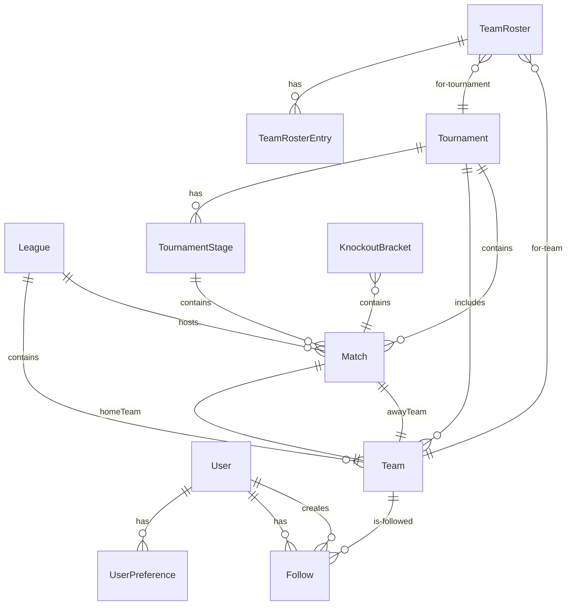

# Pitchside R2 — Unified Architecture

**Prepared by:** Brainiac (Web Solution Architect)
**Date:** 2026-06-24
**Reference:** Shared conventions at `/shared-conventions.md`, all 4 epic BA docs

---

## 1. Unified Data Model

### 1.1 Entity Overview

14 TypeScript interfaces/types distributed across `src/data/types.ts`:

```
Team (ext)
  ├── League (new)
  ├── Follow (new)
  ├── User (new)
  ├── UserPreference (new)
  ├── Tournament (new)
  ├── TournamentStage (new)
  ├── TeamRoster (new)
  ├── TeamRosterEntry (new)
  ├── Player (new)
  ├── KnockoutMatch (new)
  ├── KnockoutBracket (alias)
  ├── TournamentState (new)
  ├── Standing (ext)
```

### 1.2 Complete Type Definitions

```typescript
// ========================================
// CORE ENTITIES (existing + extended)
// ========================================

type TeamType = "club" | "national";
type MatchStatus = "upcoming" | "live" | "completed";

interface Team {
  id: string;            // UUID, PK
  name: string;
  slug: string;          // kebab-case
  type: TeamType;
  crestUrl: string;      // team logo
  flag: string;          // country flag emoji/URL
  founded?: number;
  stadium?: string;
  leagueId: string | null;   // FK → League.id (club teams only; null for national)
  caps?: number;         // International caps (national teams only)
  goals?: number;        // International goals (national teams only)
}

interface League {
  id: string;            // UUID, PK
  name: string;
  slug: string;          // kebab-case
  logoUrl: string;       // SVG icon or team crest URL
  country: string;       // ISO country name
  type: "club" | "international-club";
  seasonStart: Date;     // e.g., 2026-08-15
  seasonEnd: Date;       // e.g., 2027-05-20
  // Derived (populated at build time, not stored in data files):
  teams: Team[];         // filtered from Team[] by leagueId
  matches: Match[];      // filtered from Match[] by leagueId
}

interface Standing {
  teamId: string;
  teamName: string;
  teamSlug: string;
  teamCrestUrl: string | null;
  played: number;
  won: number;
  drawn: number;
  lost: number;
  goalsFor: number;
  goalsAgainst: number;
  goalDifference: number;
  points: number;
  qualificationStatus?: "qualified" | "eliminated" | "contending";
}

interface Match {
  id: string;            // UUID, PK
  homeTeamId: string;
  awayTeamId: string;
  date: string;          // ISO 8601 date string (UTC)
  kickoff: string;       // ISO 8601 datetime string (UTC)
  status: MatchStatus;
  homeScore: number | null;
  awayScore: number | null;
  venue?: string;
  competition: string;   // Display label: "WC Group A", "La Liga", "FIFA World Cup 2026"
  competitionType?: string; // Internal type: "fifa-world-cup-2026", "euro-2024", "friendlies"
  leagueId?: string;     // FK → League.id (for club matches)
  tournamentStageId?: string; // FK → TournamentStage.id (for international matches)
  group?: string;        // Group letter (e.g., "A", "B") for World Cup group matches
  stage?: string;        // Stage name (e.g., "Group Stage", "Round of 32")
  matchday?: number;     // Matchday number for league fixtures
}
```

**Decision:** Match uses `date` (date-only ISO) for display and `kickoff` (datetime ISO) for time-based computation. This separates the "day of" concept (used in UI labels) from the "kickoff time" concept (used in `getMatchesThisWeek()` and timezone conversion). This resolves the ambiguity between Epic 2's `date: Date` and Epic 4's `date: string`.

### 1.3 AUTH & USER ENTITIES

```typescript
interface User {
  id: string;            // UUID, PK
  provider: "google" | "github";
  providerId: string;    // Provider's unique user ID
  email: string | null;
  displayName: string;
  avatarUrl: string | null;
  tenantId: string;      // Single tenant for R2
  createdAt: Date;
  updatedAt: Date;
  // UNIQUE(provider, providerId)
}

interface UserPreference {
  id: string;            // UUID, PK
  userId: string;        // UUID, FK → User.id, unique
  timezone: string;      // IANA timezone, default "UTC"
  theme: "dark";         // R2 only — dark enforced
  createdAt: Date;
  updatedAt: Date;
}

interface Follow {
  id: string;            // UUID, PK
  userId: string;        // UUID, FK → User.id
  teamId: string;        // UUID, FK → Team.id (NOT slug)
  createdAt: Date;
  // UNIQUE(userId, teamId)
}
```

### 1.4 TOURNAMENT ENTITIES (Epic 4)

```typescript
type TournamentCategory =
  | "world-cup"
  | "continental-championship"
  | "olympics"
  | "confederations-cup"
  | "friendlies"
  | "qualifiers";

type TournamentStatus = "upcoming" | "ongoing" | "completed";

interface Tournament {
  id: string;            // UUID, PK
  name: string;
  slug: string;
  category: TournamentCategory;
  logoUrl?: string;
  hostCountries: string[];
  seasonStart: Date;
  seasonEnd: Date;
  status: TournamentStatus;
  stages: TournamentStage[];
  groupStandings?: Standing[][];  // Per-group standings (computed or seeded)
  teams: Team[];         // Reference to teams in this tournament
  matches: Match[];      // Reference to all tournament matches
  knockoutResults?: KnockoutBracket;
}

interface TournamentStage {
  id: string;            // UUID, PK
  name: string;
  stageOrder: number;
  startDate: Date;
  endDate: Date;
  matchCount: number;
  description?: string;
  isKnockout?: boolean;
}

interface TeamRoster {
  tournamentId: string;  // FK → Tournament.id
  teamId: string;        // FK → Team.id (national team)
  entries: TeamRosterEntry[];
}

interface TeamRosterEntry {
  squadNumber: number;
  playerId: string;      // FK → Player.id (or name fallback)
  playerName: string;
  position: "GK" | "DF" | "MF" | "FW";
  appearances?: number;
  goals?: number;
  assists?: number;
}

interface Player {
  id: string;
  name: string;
  teamId: string;
  position: "GK" | "DF" | "MF" | "FW";
  squadNumber: number;
  caps?: number;
  goals?: number;
}
```

### 1.5 KNOCKOUT BRACKET

Standardized from Epic 4 convention (Epic 2's KnockoutRound was aliased to this):

```typescript
interface KnockoutMatch {
  id: string;            // e.g., "R32-1", "R16-3"
  stage: string;         // e.g., "Round of 32"
  roundOrder: number;    // 1 = Round of 32, 2 = Round of 16, etc.
  homeTeam: string | null;  // Team name/slug or "TBD" / position label
  awayTeam: string | null;
  homeScore: number | null;
  awayScore: number | null;
  date: string | null;   // ISO string or null if TBD
  venue: string | null;
  winner: string | null; // Team slug (populated after match)
  nextMatchId: string | null; // FK to next round match
  defeatedTeam: string | null;
}

type KnockoutBracket = KnockoutMatch[];
```

**Decision:** The flat array with `nextMatchId` linking is simpler to render than nested `KnockoutRound` objects. The `roundOrder` field handles grouping for UI rendering (all matches with roundOrder=1 are Round of 32). `winner` field propagates through the bracket — a match's winner becomes the `homeTeam` or `awayTeam` label in the next round's `nextMatchId` target.

### 1.6 HOME PAGE STATE

```typescript
type TournamentPhase = "group" | "knockout";

interface TournamentState {
  phase: TournamentPhase;
  phaseEndDate: Date | null;   // Last group match date
  lastUpdated: Date;
}
```

### 1.7 Entity Relationship Diagram



### 1.8 Data File Structure

```
src/
  data/
    types.ts          → All 14 type definitions
    teams.ts          → Team[] (all teams: club + national)
    leagues.ts        → League[] (3+ seeded leagues)
    matches.ts        → Match[] (all matches: club + international)
    tournaments.ts    → Tournament[] (World Cup 2026 + placeholders)
    rosters.ts        → TeamRoster[] (squad lists)
    players.ts        → Player[] (optional, fallback to name strings)
    data/
      teams.ts        → Repository functions (getTeams, getTeamBySlug, etc.)
      leagues.ts      → Repository functions (getAllLeagues, getLeagueBySlug, etc.)
      matches.ts      → Repository functions (getAllMatches, getMatchesThisWeek, etc.)
      tournaments.ts  → Repository functions (getAllTournaments, getTournamentBySlug, etc.)
      follows.ts      → Repository functions (getUserFollows, createFollow, deleteFollow, etc.)
      auth.ts         → Repository functions for User/UserPreference CRUD
  lib/
    standings.ts      → computeStandings(), computeKnockoutResults(), isLive(), getMatchesThisWeek()
  hooks/
    useAuth.ts        → useAuth() hook wrapping Auth.js session
    useFollowTeams.ts → useFollowTeams() hook (localStorage for anonymous, DB for logged-in)
```

---

## 2. Route Table

### 2.1 Complete Route Map

```
┌────────────┬──────────────────────┬──────────┬─────────┬────────────────────────────────┐
│ Route      │ Page                 │ Auth     │ Epic    │ Description                    │
├────────────┼──────────────────────┼──────────┼─────────┼────────────────────────────────┤
│ /          │ Homepage             │ No       │ 2       │ Weekly strip, WC groups/knockout, followed teams, club leagues │
│ /leagues   │ League Directory     │ No       │ 3       │ Icon grid with search & type filter │
│ /league/[slug] │ League Detail    │ No       │ 3       │ Tabs: Standings, Fixtures, Teams │
│ /international │ Intl. Overview  │ No       │ 4       │ Tournament grid with search & category filter │
│ /tournament/[slug] │ Tournament Detail │ No   │ 4       │ Tabs: Groups, Standings, Fixtures, Knockout, Teams │
│ /national-team/[slug] │ National Team Detail │ No │ 4    │ Team overview with tournament tabs, roster │
│ /team/[slug] │ Team Detail        │ No       │ 3/4     │ Club/International tabs, standings, upcoming/recent │
│ /group/[letter] │ WC Group Page │ No       │ 2       │ Individual World Cup group standings │
│ /search    │ Search Teams         │ No       │ 3       │ Unified search (club/national, league/competition filters) │
│ /feed      │ Personal Dashboard   │ **Yes**  │ 1       │ Followed teams' matches & results │
│ /login     │ Sign In              │ No       │ 1       │ OAuth buttons (Google, GitHub); redirects to / if already logged in │
│ /account   │ Account Settings     │ **Yes**  │ 1       │ Profile, timezone, followed teams, notification placeholder │
├────────────┼──────────────────────┼──────────┼─────────┼────────────────────────────────┤
│ /auth/callback/[provider] │ Auth Callback │ No  │ 1   │ Auth.js v5 OAuth callback │
│ /api/follows     │ Follow API    │ **Yes**  │ 1   │ GET/POST followed teams │
│ /api/follows/[teamId] │ Unfollow API │ **Yes** │ 1  │ DELETE follow │
└────────────┴──────────────────────┴──────────┴─────────┴────────────────────────────────┘
```

### 2.2 Auth Guard Strategy

All routes follow conventions §7 (Auth.js v5 middleware):

```typescript
// middleware.ts (Next.js middleware)
export function middleware(request: NextRequest) {
  return auth(request);  // Auth.js v5 built-in
}

export const config = {
  matcher: [
    '/feed/:path*',   // Must be authenticated
    '/account/:path*', // Must be authenticated
  ],
};

// /feed and /account are the ONLY protected routes.
// /login redirects to / if already authenticated (handled on the page component).
// All other routes are public.
```

**Per-page auth logic:**

- `/feed`: Auth.js session checked. If `null`, redirect to `/login?returnTo=${encodeURIComponent(pathname)}`.
- `/account`: Auth.js session checked. If `null`, redirect to `/login?returnTo=${encodeURIComponent(pathname)}`.
- `/login`: Checks `getServerSession()`. If session exists, redirects to `/`.
- All other routes: No auth check needed.

### 2.3 Route to Component Mapping

```
Route                          →  Page Component File                    →  Dependencies
───────────────────────────────┼────────────────────────────────────────┼────────────────────────────────
/                              →  src/app/page.tsx                       →  WeeklyStrip, GroupStandingsGrid/KnockoutBracket, FollowedTeamsSection, ClubTeamsSection
/leagues                       →  src/app/leagues/page.tsx               →  LeagueGrid, LeagueCard, search filter
/league/[slug]                 →  src/app/league/[slug]/page.tsx         →  LeagueHeader, LeagueTabs, StandingsTable, MatchCard, TeamCard
/international                 →  src/app/international/page.tsx         →  TournamentGrid, TournamentCard, TournamentSearchFilter
/tournament/[slug]             →  src/app/tournament/[slug]/page.tsx     →  TournamentTabs, GroupStandings, KnockoutBracketView, TeamRosterTable
/national-team/[slug]          →  src/app/national-team/[slug]/page.tsx  →  NationalTeamHeader, InternationalMatchFeed, TournamentTabs
/team/[slug]                   →  src/app/team/[slug]/page.tsx           →  TeamCard, MatchCard, StandingsTable, FollowButton
/group/[letter]                →  src/app/group/[letter]/page.tsx        →  GroupStandingsGrid (single group)
/search                        →  src/app/search/page.tsx                →  TeamCard, filters
/feed                          →  src/app/feed/page.tsx                  →  MatchCard, FollowButton (auth-gated)
/login                         →  src/app/login/page.tsx                 →  OAuth buttons
/account                       →  src/app/account/page.tsx               →  Profile form, TeamCard, FollowButton
```

---

## 3. Component Hierarchy

### 3.1 Shared Components (cross-epic reuse)

```
src/components/
  Header.tsx                 →  Unified nav (conventions §1). Shared by ALL pages.
  FollowButton.tsx           →  Follow/unfollow toggle (localStorage ↔ DB). Shared by ALL team-display pages.
  TeamCard.tsx               →  Team name, logo, flag, link to /team/[slug]. Used on /leagues, /league/[slug], /tournament/[slug], /team/[slug], homepage club section.
  StandingsTable.tsx         →  Standings grid with P/W/D/L/GF/GA/GD/Pts. Used on /group/[letter], /league/[slug], /tournament/[slug].
  CountdownRing.tsx          →  Countdown timer to match kickoff. Used on homepage weekly strip, fixtures tabs, team page upcoming matches.
  MatchCard.tsx              →  Match display: teams, score, date, LIVE badge. Used on homepage, fixtures tabs, /feed.
```

### 3.2 Epic 2 Components (Homepage)

```
src/app/page.tsx (Homepage)
├── WeeklyStrip (matches: Match[])
│   └── MatchCard (compact, with competition label)
├── GroupStandingsGrid (groups: Standing[][])
│   └── StandingsTable (standings: Standing[])
│       └── TeamLink (team name → /team/[slug])
├── KnockoutBracket (rounds: KnockoutMatch[])   [conditional — when phase === "knockout"]
│   └── KnockoutMatchCard (match: KnockoutMatch)
├── FollowedTeamsSection (followedTeams: Team[], matches: Match[], isLoggedIn: boolean)
│   ├── MatchCard (upcoming/recent)
│   │   └── CountdownRing (if upcoming)
│   └── FollowButton (on each team name)
└── ClubTeamsSection (leagues: League[])
    └── ClubLeagueCard (league: League)
        ├── TeamCard × 5
        └── StandingsTable (summary)
```

### 3.3 Epic 3 Components (League Directory)

```
src/app/leagues/page.tsx (/leagues)
├── LeagueGrid (leagues: League[], searchQuery: string, filterType: string)
│   └── LeagueCard (league: League)
│       ├── LeagueLogo
│       ├── LeagueName
│       ├── LeagueCountry
│       └── ViewArrow → /league/[slug]

src/app/league/[slug]/page.tsx (/league/[slug])
├── LeagueHeader (league: League)
├── LeagueTabs (activeTab: string, onTabChange: (tab) => void)
│   ├── Standings Tab
│   │   └── StandingsTable (standings: Standing[])
│   │       └── TeamLink → /team/[slug]
│   ├── Fixtures Tab
│   │   └── MatchdayGroup (matchday: string, matches: Match[])
│   │       └── FixtureCard (match: Match)
│   │           ├── MatchCard
│   │           ├── TeamLink (home)
│   │           └── TeamLink (away)
│   └── Teams Tab
│       └── LeagueTeamList (teams: Team[])
│           └── TeamCard → /team/[slug]

src/app/team/[slug]/page.tsx (/team/[slug]) — extended by Epic 3
├── TeamHeader (team: Team, league?: League)   ← Epic 3 adds league context
├── LeagueBadge (league: League) → /league/[slug]
├── TeamTabs (Club / International)
│   ├── Club Tab → MatchCard × n
│   └── International Tab → MatchCard × n
├── StandingsSection (if applicable)
│   └── StandingsTable
└── FollowButton
```

### 3.4 Epic 4 Components (International)

```
src/app/international/page.tsx (/international)
├── TournamentSearchFilter (categories: TournamentCategory[])
├── TournamentGrid (tournaments: Tournament[])
│   └── TournamentCard (tournament: Tournament)
│       ├── TournamentLogo
│       ├── TournamentName
│       ├── StatusBadge (Upcoming/Ongoing/Completed)
│       └── HostCountries

src/app/tournament/[slug]/page.tsx (/tournament/[slug])
├── TournamentBanner (tournament: Tournament)
├── TournamentTabs (tournament: Tournament)
│   ├── Groups Tab
│   │   └── GroupStandings (standings: Standing[], groupName: string) × n
│   ├── Standings Tab
│   │   └── StandingsTable (aggregate standings)
│   ├── Fixtures Tab
│   │   └── MatchCard × n (grouped by date)
│   ├── Knockout Tab (conditional — hidden if no knockout stage)
│   │   └── KnockoutBracketView (knockout: KnockoutBracket)
│   └── Teams Tab
│       └── TeamCard × 48 (searchable grid)

src/app/national-team/[slug]/page.tsx (/national-team/[slug])
├── NationalTeamHeader (team: Team)
├── InternationalMatchFeed (matches: Match[])
├── TournamentTabs (team: Team)
│   └── Tournament-specific matches + optional TeamRosterTable
└── FollowButton
```

### 3.5 Epic 1 Components (Auth)

```
src/app/login/page.tsx (/login)
├── OAuthButton (provider: "google" | "github") × 2
├── Divider ("or")
└── AuthErrorMessage (conditional)

src/app/feed/page.tsx (/feed) — authenticated dashboard
├── FeedHeader (user: User)
├── MatchCard × n (upcoming matches grouped by date)
│   └── CountdownRing
├── MatchCard × n (recent results)
└── EmptyState (if no follows)

src/app/account/page.tsx (/account)
├── ProfileSection
│   ├── Avatar (large)
│   ├── DisplayName (editable)
│   ├── Email (read-only)
│   └── ProviderIcon
├── SettingsSection
│   ├── TimezoneDropdown
│   ├── NotificationPlaceholder ("Coming in a future release.")
│   └── FollowedList
│       └── TeamCard + FollowButton (as Unfollow)
```

### 3.6 Component Reuse Matrix

| Component | Epic 1 | Epic 2 | Epic 3 | Epic 4 |
|-----------|--------|--------|--------|--------|
| `Header` | ✅ | ✅ | ✅ | ✅ |
| `FollowButton` | ✅ (core) | ✅ | ✅ | ✅ |
| `TeamCard` | | ✅ | ✅ | ✅ |
| `StandingsTable` | | ✅ | ✅ | ✅ |
| `CountdownRing` | ✅ | ✅ | ✅ | ✅ |
| `MatchCard` | ✅ | ✅ | ✅ | ✅ |
| `LeagueCard` | | | ✅ | |
| `LeagueGrid` | | | ✅ | |
| `LeagueHeader` | | | ✅ | |
| `LeagueTabs` | | | ✅ | |
| `LeagueTeamList` | | | ✅ | |
| `WeeklyStrip` | | ✅ | | |
| `GroupStandingsGrid` | | ✅ | | |
| `KnockoutBracket` | | ✅ | | |
| `FollowedTeamsSection` | | ✅ | | |
| `ClubTeamsSection` | | ✅ | | |
| `TournamentCard` | | | | ✅ |
| `TournamentGrid` | | | | ✅ |
| `TournamentTabs` | | | | ✅ |
| `KnockoutBracketView` | | | | ✅ |
| `TeamRosterTable` | | | | ✅ |
| `NationalTeamHeader` | | | | ✅ |
| `TournamentSearchFilter` | | | | ✅ |

---

## 4. Shared Utilities

### 4.1 `src/lib/standings.ts`

```typescript
// Core standings computation — used by Epic 2 (World Cup groups)
// and Epic 3 (league standings) and Epic 4 (tournament groups)
export function computeStandings(
  matches: Match[],
  teams: Team[],
): Standing[] {
  // Takes completed matches, computes P/W/D/L/GF/GA/GD/Pts
  // Groups by team, computes aggregates
  // Sorts: (1) Points desc, (2) GD desc, (3) GF desc
  // Returns Standing[] with qualificationStatus
}

// Knockout bracket propagation — used by Epic 2 (WC knockout)
// and Epic 4 (tournament knockouts)
export function computeKnockoutResults(
  rounds: KnockoutMatch[],
): KnockoutBracket {
  // Determines winners from homeScore/awayScore
  // Propagates winners to next round via nextMatchId linking
  // Returns KnockoutBracket with updated team labels
}

// Live match detection — used by homepage, fixtures tabs
export function isLive(match: Match): boolean {
  const kickoff = new Date(match.kickoff);
  const now = new Date();
  const diffMs = Math.abs(now.getTime() - kickoff.getTime());
  return diffMs < 2 * 60 * 60 * 1000; // within 2 hours
}
```

### 4.2 `src/lib/matches.ts`

```typescript
// "This Week" aggregation — called by homepage Epic 2
// Aggregates from ALL data sources (WC groups, WC knockouts, club leagues, international tournaments)
export function getMatchesThisWeek(
  allMatches: Match[],
  currentDay: Date,
): Match[] {
  // Returns matches where:
  // currentDay.startOfWeek (Monday) ≤ match.kickoff < currentDay.endOfWeek (Sunday)
  // Sorted by kickoff time ascending
}

// Match filtering helpers
export function getCompletedMatches(matches: Match[]): Match[];
export function getUpcomingMatches(matches: Match[]): Match[];
export function getMatchesForTeam(matches: Match[], teamId: string): Match[];
export function getRecentMatches(matches: Match[], teamId: string, limit?: number): Match[];
```

### 4.3 `src/lib/data/team.ts`

```typescript
// Repository pattern (conventions §7.3)
export async function getTeams(): Promise<Team[]>;
export async function getTeamBySlug(slug: string): Promise<Team | null>;
export async function getTeamsByType(type: TeamType): Promise<Team[]>;
export async function getTeamsByLeagueId(leagueId: string): Promise<Team[]>;
export async function getFollowedTeams(): Promise<Team[]>; // localStorage or DB via session
export async function searchTeams(query: string): Promise<Team[]>;
```

### 4.4 `src/lib/data/league.ts`

```typescript
export async function getAllLeagues(): Promise<League[]>;
export async function getLeagueBySlug(slug: string): Promise<League | null>;
export async function getLeaguesByType(type: string): Promise<League[]>;
export async function searchLeagues(query: string): Promise<League[]>;
```

### 4.5 `src/lib/data/tournament.ts`

```typescript
export async function getAllTournaments(): Promise<Tournament[]>;
export async function getTournamentBySlug(slug: string): Promise<Tournament | null>;
export async function getTournamentsByCategory(category: TournamentCategory): Promise<Tournament[]>;
export async function searchTournaments(query: string): Promise<Tournament[]>;
```

### 4.6 `src/lib/data/follows.ts`

```typescript
// Follow repository — used by useFollowTeams hook
export async function getUserFollows(userId: string): Promise<Follow[]>;
export async function createFollow(userId: string, teamId: string): Promise<Follow>;
export async function deleteFollow(userId: string, teamId: string): Promise<void>;
export async function isFollowing(userId: string, teamId: string): Promise<boolean>;
```

### 4.7 `src/lib/time.ts`

```typescript
// Timezone utilities — used by ALL pages with date display
export function convertToUserTime(dateString: string, timezone: string): string;
export function getWeekRange(date: Date): { start: Date; end: Date }; // Monday-Sunday
```

---

## 5. Contracts Section

### 5.1 `useAuth()` Hook API

```typescript
// src/hooks/useAuth.ts

interface AuthUser {
  id: string;
  name: string;
  email: string | null;
  image: string | null;
  provider: "google" | "github";
}

interface UseAuthReturn {
  user: AuthUser | null;
  session: unknown;           // Auth.js v5 session (passed through)
  isLoading: boolean;         // True while session is being fetched
  signIn: (provider: "google" | "github") => Promise<void>;
  signOut: () => Promise<void>;
  updateDisplayName: (name: string) => Promise<void>;
  updateTimezone: (timezone: string) => Promise<void>;
}

// Implementation wraps Auth.js v5:
// - signIn(provider) → calls signIn(provider, { callbackUrl: window.location.href })
// - signOut() → calls signOut({ callbackUrl: "/" })
// - updateDisplayName() → PATCH /api/user (updates User.displayName)
// - updateTimezone() → PATCH /api/user-preference (updates UserPreference.timezone)
//
// The hook is a React context provider in src/app/ providers.tsx:
// <AuthProvider>{children}</AuthProvider>
//
// Usage: const { user, signIn, signOut } = useAuth();
```

### 5.2 `useFollowTeams()` Hook API

```typescript
// src/hooks/useFollowTeams.ts

interface UseFollowTeamsReturn {
  followedTeamIds: string[];    // UUID strings (team.id)
  followedTeams: Team[];        // Full Team objects
  isFollowing: (teamId: string) => boolean;
  followTeam: (teamId: string) => Promise<void>;
  unfollowTeam: (teamId: string) => Promise<void>;
  toggleFollow: (teamId: string) => Promise<void>;
  isLoading: boolean;
  migrationComplete: boolean;   // True after localStorage → DB migration
  migrating: boolean;           // True during migration
}

// Implementation:
// - When user === null (anonymous): read/write from localStorage key "pitchside-following"
//   Value: string[] of team slugs (kebab-case)
// - When user !== null (logged in): read/write from database via /api/follows
//   Value: Follow[] with teamId (UUID)
// - On first authenticated load: read localStorage slugs, look up Team.id for each slug,
//   insert Follow records, then clear localStorage
// - Hook interface: followTeam(slug | Team) — accepts slug for anonymous, UUID for logged-in
//   Internally converts as needed
//
// Usage: const { followedTeams, followTeam, unfollowTeam } = useFollowTeams();
//        followTeam("real-madrid"); // anonymous (slug)
//        followTeam(team.id);      // logged-in (UUID)
```

### 5.3 Data Access Layer API

```typescript
// src/lib/data/ - repository functions
// All functions are async for future API swap compatibility
// Current implementation reads from static data files (src/data/*.ts)
// Future implementation swaps to database queries without changing page components

// Team repository
getTeams(): Promise<Team[]>
getTeamBySlug(slug: string): Promise<Team | null>
getTeamsByType(type: TeamType): Promise<Team[]>
getTeamsByLeagueId(leagueId: string): Promise<Team[]>
getTeamsByTournamentId(tournamentId: string): Promise<Team[]>

// League repository
getAllLeagues(): Promise<League[]>
getLeagueBySlug(slug: string): Promise<League | null>
getLeaguesByType(type: string): Promise<League[]>
searchLeagues(query: string): Promise<League[]>

// Match repository
getAllMatches(): Promise<Match[]>
getMatchesThisWeek(matches: Match[], currentDay: Date): Match[]
getMatchesForTeam(teamId: string): Match[]
getMatchesForLeague(leagueId: string): Match[]
getMatchesForTournament(tournamentId: string): Match[]
getCompletedMatches(matches: Match[]): Match[]
getUpcomingMatches(matches: Match[]): Match[]

// Tournament repository
getAllTournaments(): Promise<Tournament[]>
getTournamentBySlug(slug: string): Promise<Tournament | null>
getTournamentsByCategory(category: TournamentCategory): Promise<Tournament[]>
searchTournaments(query: string): Promise<Tournament[]>

// Follow repository
getUserFollows(userId: string): Promise<Follow[]>
createFollow(userId: string, teamId: string): Promise<Follow>
deleteFollow(userId: string, teamId: string): Promise<void>
isFollowing(userId: string, teamId: string): Promise<boolean>
```

### 5.4 Shared Component Props

```typescript
// MatchCard props
interface MatchCardProps {
  match: Match;
  showCompetition?: boolean;   // Show competition label (default: false)
  compact?: boolean;           // Compact layout (default: false)
  userTimezone?: string;       // Timezone for date display (default: browser/UTC)
}

// StandingsTable props
interface StandingsTableProps {
  standings: Standing[];
  showQualification?: boolean;  // Show qualified/eliminated indicators (default: false)
  onTeamClick?: (teamSlug: string) => void;  // Optional click handler
}

// TeamCard props
interface TeamCardProps {
  team: Team;
  showFlag?: boolean;          // Show country flag (default: true for national teams)
  showLeague?: boolean;        // Show league badge (default: false)
  onClick?: () => void;        // Optional click handler (default: navigate to /team/[slug])
}

// FollowButton props
interface FollowButtonProps {
  teamId: string;              // Team UUID
  teamSlug?: string;           // Team slug (for anonymous users)
  size?: "sm" | "md";         // Button size (default: "sm")
  onStateChange?: (following: boolean) => void;  // Optional callback
}

// CountdownRing props
interface CountdownRingProps {
  date: string;                // ISO date string (UTC)
  userTimezone?: string;       // Timezone for display
  showLabel?: boolean;         // Show text label below ring (default: true)
}

// LeagueCard props
interface LeagueCardProps {
  league: League;
  onClick?: (slug: string) => void;
}

// TournamentCard props
interface TournamentCardProps {
  tournament: Tournament;
  onClick?: (slug: string) => void;
}
```

---

## 6. Build Decomposition Plan

The architecture splits into 4 build sub-tasks, each targeting ~35 turns:

### Task A: Auth + Data Layer (foundational)

**Scope:** Epic 1 + shared infrastructure
- Auth.js v5 setup (Google + GitHub providers, middleware, routes)
- User, UserPreference, Follow type definitions and DB schema
- Follow API endpoints (/api/follows)
- useAuth() hook
- useFollowTeams() hook (localStorage + DB + migration)
- Repository layer foundation (teams, follows)
- /login, /feed, /account pages

**Dependencies:** None (foundational)

**Contracts consumed:** None (this task PRODUCES the auth and data contracts)

**Contracts provided:**
- `useAuth()` hook API (Section 5.1)
- `useFollowTeams()` hook API (Section 5.2)
- Follow API endpoints: GET/POST /api/follows, DELETE /api/follows/[teamId]
- Follow repository functions
- User + UserPreference + Follow type definitions

**Order:** 1st (must complete before any other task)

---

### Task B: Homepage + Shared Utilities

**Scope:** Epic 2 + shared utilities + shared components
- `computeStandings()` and `computeKnockoutResults()` in src/lib/standings.ts
- `getMatchesThisWeek()` in src/lib/matches.ts
- Repository layer: matches, leagues, tournaments
- Timezone utilities (src/lib/time.ts)
- Shared components: MatchCard, CountdownRing, FollowButton (updated for auth), StandingsTable
- Homepage page: WeeklyStrip, GroupStandingsGrid, KnockoutBracket, FollowedTeamsSection, ClubTeamsSection
- TournamentState phase logic (group ↔ knockout)

**Dependencies:** Task A (needs useFollowTeams, useAuth for FollowedTeamsSection)

**Contracts consumed:**
- `useAuth()` hook (for FollowedTeamsSection auth check)
- `useFollowTeams()` hook (for FollowedTeamsSection data)

**Contracts provided:**
- Shared utility functions (standings, matches, time)
- Updated shared components (FollowButton, MatchCard, CountdownRing, StandingsTable)
- Homepage layout with all 5 sections

**Order:** 2nd (depends on A for auth-dependent homepage section)

---

### Task C: League Directory + International + Team Detail

**Scope:** Epic 3 + Epic 4 + team page
- `/leagues` page (LeagueGrid, LeagueCard, search/filter)
- `/league/[slug]` page (LeagueHeader, LeagueTabs, Standings/Fixtures/Teams)
- `/international` page (TournamentGrid, TournamentCard, TournamentSearchFilter)
- `/tournament/[slug]` page (TournamentTabs, GroupStandings, KnockoutBracketView, TeamRosterTable)
- `/national-team/[slug]` page (NationalTeamHeader, InternationalMatchFeed)
- `/team/[slug]` page extensions (league badge from Epic 3, international tab from Epic 4)
- `/group/[letter]` page
- `/search` page
- Header component update (International nav item)

**Dependencies:** Task A (teamId type reference), Task B (shared components)

**Contracts consumed:**
- All shared components from Tasks A+B
- `computeStandings()` and `computeKnockoutResults()` from Task B
- Team + League + Tournament type definitions from Task A

**Contracts provided:**
- Complete Epic 3 and Epic 4 pages
- Extended team page with league context and international tab

**Order:** 3rd (depends on A and B for shared types, components, utilities)

---

### Task D: Polish + Edge Cases

**Scope:** Cross-cutting polish, responsive design, accessibility
- Responsive layouts: mobile breakpoints for all pages
- Error/empty states on all pages
- Loading skeletons for data sections
- SEO metadata (Open Graph, Twitter Cards) on all pages
- Route validation: invalid slugs (e.g., /league/nonexistent → "not found" page)
- Keyboard navigation for tab components
- Performance: lazy-loading images, code splitting for heavy components
- Final verification: all acceptance criteria covered across all 4 epics

**Dependencies:** Task C (needs all pages built for polish)

**Contracts consumed:** All contracts from Tasks A, B, C

**Contracts provided:** None (polish only)

**Order:** 4th (final polish after all pages are built)

---

## 7. Tech Stack Decisions

| Decision | Choice | Rationale | Alternatives Considered |
|----------|--------|-----------|------------------------|
| Framework | Next.js 14+ App Router | Convention compliance, SSR/SSG, built-in routing | Create React App, Remix |
| Language | TypeScript | Type safety across components and data layer | Plain JavaScript |
| Auth | Auth.js v5 | Next.js ecosystem native, edge runtime support, Web Crypto API | Supabase Auth, custom JWT |
| Database | PostgreSQL (recommended) | ACID compliance, mature Next.js integration (Drizzle ORM or Prisma) | SQLite, MongoDB |
| Styling | Tailwind CSS | Convention compliance, dark theme, utility-first | CSS modules, styled-components |
| State (client) | React hooks (useState, useEffect) | No complex global state needed | Zustand, Redux |
| State (server) | Auth.js sessions or JWT | Simple, no additional infrastructure | Database sessions only |
| Data layer | Static seed data (R2) + repository pattern | No API integration in R2, future-proof for API swap | Direct API calls |
| Deploy | Vercel (recommended) | Next.js native hosting, easy OIDC setup for Auth.js | Self-hosted, Docker |

---

## 8. Risks & Mitigations

| Risk | Severity | Mitigation |
|------|----------|------------|
| Auth.js v5 migration instability | Medium | v5 is stable (released 2024-01). Use well-documented patterns. Pin version. |
| OAuth credential availability blocks Epic 1 | High | Chris must register OAuth apps before implementation. Blocker flag for Steel. |
| Static data file bloat (48 WC teams + match data) | Low-Medium | Split data by domain (teams.ts, matches.ts, tournaments.ts). Use lazy imports. |
| Shared component prop drift between epics | Medium | Strict contract definitions in Section 5.4. Each sub-task consumes exact prop shapes. |
| Standings computation correctness | Medium | Unit-test computeStandings() with known inputs. Shared across 3 epics — one bug affects all. |
| Timezone conversion bugs | Medium | Centralized in src/lib/time.ts. Use `date-fns-tz` library. Test with known timezones. |
| Dark theme visual contrast issues | Low | Tailwind slate palette has good contrast ratios. Visual regression QA in Zod task. |

---

*Document generated 2026-06-24 by Brainiac, Fortress of Solitude Consulting.*
*Handoff pipeline: Brainiac → Kara (design) → Steel (implementation) → Zod (QA).*
